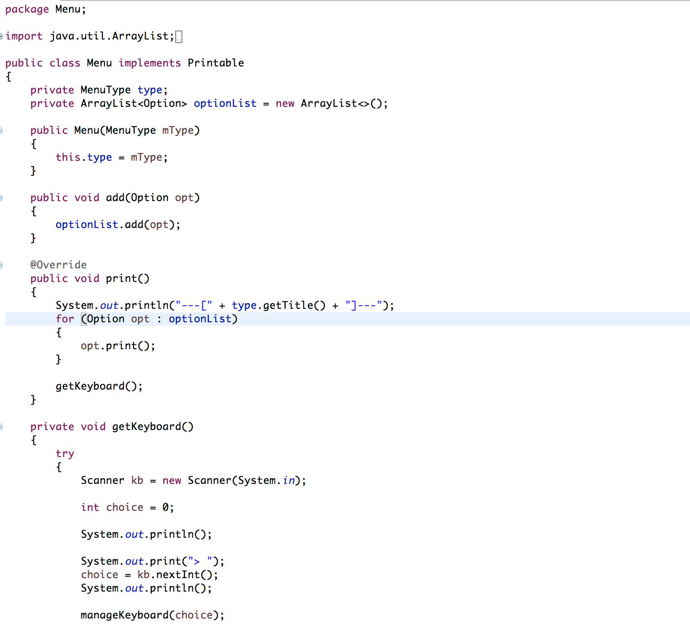

# Menu-Handler

## About

Menu-Handler is a Java library used to make the life of a developer who uses console-based menu's easier.

## Install

In order to start using this engine, you will need to clone/download it to your machine.
